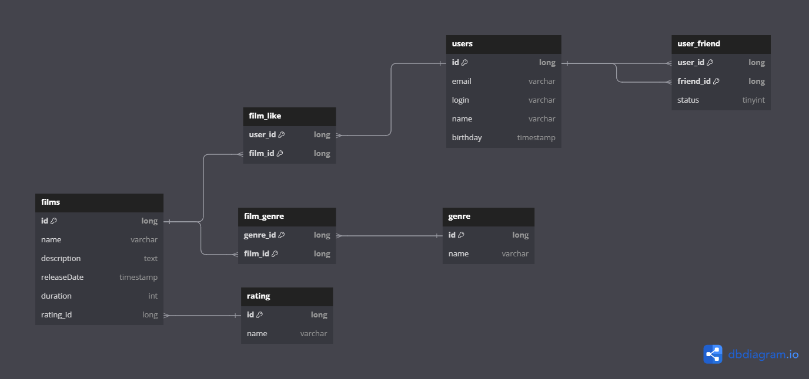

# java-filmorate

Учебный проект для yandex practicum

## Схема базы данных



## Примеры SQL запросов

Получение списка юзеров

```sql
SELECT *
FROM users;
```

Получение списка друзей

```sql
SELECT friend_id
FROM user_friend
WHERE user_id =[нужное ид] AND status = [1 для подтвержденных иначе 0];
```
Получение списка общих друзей
```sql
SELECT uf.friend_id
FROM user_friend as uf
WHERE user_id in ([ид юзеров для поиска]) AND status = [1 для подтвержденных иначе 0]
GROUP BY uf.friend_id
HAVING COUNT(user_id) >= 2; 
```
Получение списка фильмов c рейтингом

```sql
SELECT *,
       r.ratingName
FROM films
         INNER JOIN rating AS r ON film.rating_id = rating.id;
```

Получение всех жанров выбранного фильма

```sql
SELECT name
FROM genre
WHERE id IN (SELECT f.genre_id
             FROM film_genre AS f
ON f.film_id = [нужное id фильма]
    );

```

Получение списка лайков для выбранного фильма

```sql
SELECT user_id
FROM film_like
WHERE film_id =[ид выбранного фильма];
```
Получение ТОП10 фильмов по количеству лайков
```sql
SELECT f.id, COUNT(fl.user_id) as total_likes --и прочие поля
FROM film as f
LEFT JOIN film_like as fl ON f.id = fl.film_id
GROUP BY f.id
ORDER BY total_likes DESC
LIMIT 10;
```